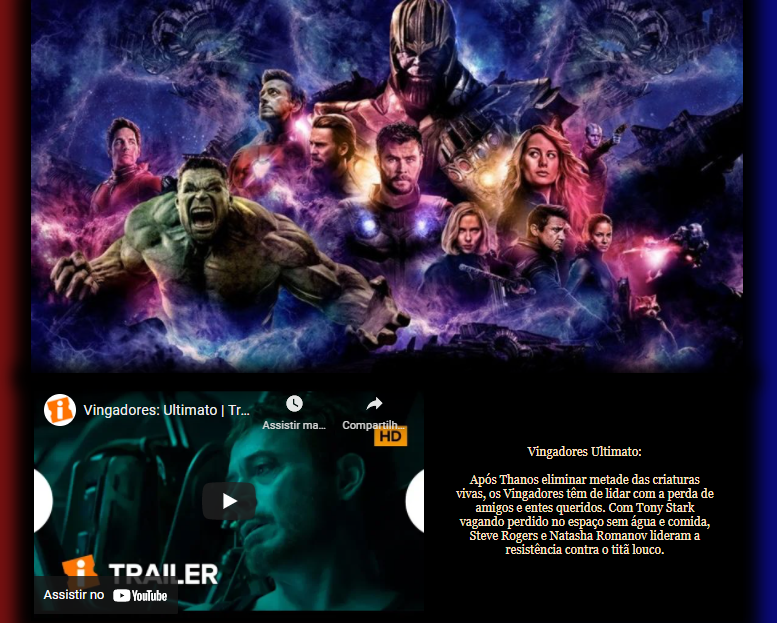

<div>

# Avangers

## Sobre o projeto.
Este projeto tem como principal objetivo criar uma página simples, com informações sobre o filme dos Avangers.
<br>
Data de conclusão: 10/12/2021
<br>
## Ferramentas e tecnologias usadas nesse projeto.
 
```js
function Avangers(Project) {
    if (Front End) {
        const Stack = `${HTML}, ${CSS}`;
    }
};
```
<br>

<div align="center">



</div>

<br><br>

---

> - Autores: 
>   - [Eduardo Kayke](https://github.com/EduardoKayke "Perfil do Eduardo")

- [Voltar ao perfil do Github.](https://github.com/EduardoKayke "Perfil do Eduardo")

_Um dia seremos a tecnologia. Biohacking a própria evolução de nós mesmos._
